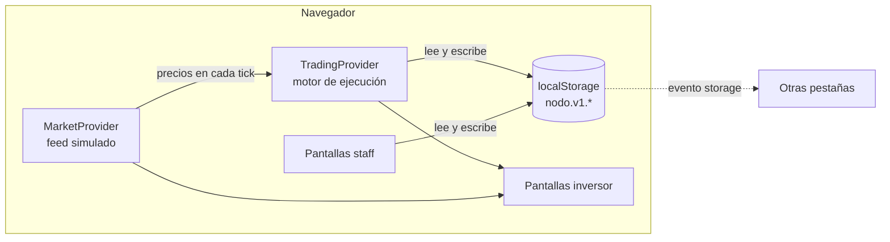

# TraderNOVA · Nodo Trading

Plataforma web de **Nodo Trading**, un broker ALyC argentino para operar acciones del Panel Líder de BYMA, CEDEARs y bonos. Reúne en un mismo proyecto Next.js las dos caras del broker:

- **App del inversor**: cotizaciones, gráficos, operatoria con stop loss y take profit, tenencia valorizada, fondos, diario de trading y soporte.
- **Back-office del staff**: comitentes y KYC, libro de órdenes, tesorería, riesgo, cumplimiento PLA/FT, mesa de ayuda y auditoría.

Además tiene una landing institucional, un login con 2FA y la apertura de cuenta en 5 pasos.

> **Demo funcional sin backend.** Los precios vienen de un feed simulado y nada llega a un mercado real. Lo que hagas se guarda en el navegador y sobrevive a la recarga: órdenes, depósitos, tickets, aprobaciones del staff y ajustes. Para volver al estado inicial, entrá a **Ajustes → Datos de la demo**.

## Índice

1. [Recorrido rápido](#recorrido-rápido)
2. [Funcionalidades](#funcionalidades)
3. [Cómo funciona por dentro](#cómo-funciona-por-dentro)
4. [Reglas de negocio](#reglas-de-negocio)
5. [Stack](#stack)
6. [Puesta en marcha](#puesta-en-marcha)
7. [Tests](#tests)
8. [Estructura del proyecto](#estructura-del-proyecto)
9. [Convenciones](#convenciones)
10. [Deploy en Vercel](#deploy-en-vercel)
11. [Valores de referencia de la demo](#valores-de-referencia-de-la-demo)
12. [De demo a producto](#de-demo-a-producto)
13. [Licencias de terceros](#licencias-de-terceros)

---

## Recorrido rápido

Un guion de unos 5 minutos para mostrar la demo completa:

1. **Ingresar.** En `/login` las credenciales ya vienen cargadas y cualquier token de 6 dígitos sirve.
2. **Dashboard.** Los KPIs se recalculan en vivo. Cambiá entre ARS y USD desde la barra superior y probá los rangos del gráfico de rendimiento.
3. **Operar.** Entrá a `/operar?especie=GGAL`, activá **Stop loss y take profit** y arrastrá las líneas en el gráfico. Enviá la compra y acelerá el feed a **x20**: el stop o el target se dispara solo y aparece una notificación con el resultado.
4. **Simulación.** Activá el interruptor **Simulación** de la barra superior. Operás con $10.000.000 virtuales, separados de la cuenta real.
5. **Fondos.** En `/cuentas`, avisá una transferencia. A los pocos segundos se acredita y el disponible sube en todas las pantallas.
6. **Soporte.** En `/soporte`, abrí una consulta. Pasá a la vista staff (menú de cuenta → **Ir a vista staff**), respondela desde **Desk & Soporte** y volvé: la respuesta está en tu consulta.
7. **Staff.** En **Libro de Órdenes** aparecen tus órdenes y podés cancelarlas. Cada acción del staff queda en **Auditoría & Roles**.
8. **Extras.** Buscador con ⌘K (Ctrl+K en Windows), tema claro con el ícono de la luna y exportaciones CSV en casi todas las tablas.

---

## Funcionalidades

### Páginas públicas

| Ruta | Pantalla | Qué se puede hacer |
| --- | --- | --- |
| `/` | Landing institucional | Presentación del broker, beneficios y accesos a login y apertura de cuenta. |
| `/login` | Iniciar sesión | Credenciales, token 2FA (con "enviar por SMS") y recuperación de contraseña. |
| `/onboarding` | Apertura de cuenta | 5 pasos: datos personales, validación de DNI (carga de frente y dorso con validación de archivo), selfie biométrica, perfil inversor y firma. |

### App del inversor

| Ruta | Pantalla | Qué se puede hacer |
| --- | --- | --- |
| `/dashboard` | Dashboard | Patrimonio, resultado del día y poder de compra en vivo, en ARS o USD. Gráfico de rendimiento con 6 rangos, 3 benchmarks y valores al pasar el mouse. Distribución por clase de activo, mayores variaciones (de tu cartera o de todo el mercado) y órdenes recientes. Accesos rápidos a ingresar dinero, comprar MEP y colocar caución. |
| `/cotizaciones` | Cotizaciones | Tabla por panel con filtro, favoritos, detalle con gráfico y libro de 5 puntas, alertas de precio y botones de compra y venta. Acepta `?panel=Bono&especie=AL30D`. |
| `/mercados` | Mercados en vivo | Panel paginado por mercado, sector y plazo de liquidación (CI, 24 hs, 48 hs), watchlist, heatmap del Merval y compra de MEP. |
| `/operar` | Boleta de operaciones | Compra y venta límite, a mercado y stop límite, con desglose de aranceles, stop loss y take profit, gráfico de velas con líneas arrastrables, libro de ofertas clickeable y caudal en vivo. Acepta `?especie=GGAL&lado=venta`. |
| `/terminal/[symbol]` | Terminal avanzada | Gráfico grande con RSI y herramientas de dibujo, libro L2, boleta rápida, caudal y pestañas de órdenes abiertas, posiciones e historial. |
| `/tenencia` | Mi tenencia | Valuación total y resultados en vivo, saldos con acciones de fondos, curva patrimonial, distribución y tabla ordenable de posiciones con exportación CSV e informe fiscal. |
| `/ordenes` | Historial de órdenes | Filtros por estado, búsqueda, cancelación, desactivación de stop y target, y exportación CSV. |
| `/cuentas` | Cuentas y fondos | Datos para transferir, aviso de depósito, retiros, compra de MEP, cuentas bancarias vinculadas (alta, predeterminada y baja) e historial de movimientos exportable. |
| `/informes` | Diario de trading | Calendario de resultados por rueda, estadísticas del mes, bitácora por día que se guarda, exportación del mes e informe fiscal. |
| `/ajustes` | Ajustes | Perfil, seguridad (2FA, cambio de contraseña, dispositivos), notificaciones, tema, moneda, test de perfil de inversor y reinicio de la demo. |
| `/soporte` | Centro de ayuda | Preguntas frecuentes con buscador, asistente Nova (respuestas por palabras clave) y consultas con un asesor, con su conversación. |

### Back-office del staff

| Ruta | Pantalla | Qué se puede hacer |
| --- | --- | --- |
| `/admin` | Consola de control | KPIs del broker, altas diarias, volumen por hora, alertas operativas, actividad de la mesa, refresco de la sesión DMA y reporte CNV. |
| `/admin/usuarios` | Usuarios y cuentas | Padrón de comitentes con filtros y búsqueda (`?q=`), legajo digital, aprobación, bloqueo, pedido de información, alta manual y exportación del padrón. |
| `/admin/kyc` | KYC y validación | La misma vista que Usuarios, filtrada en la cola de KYC pendientes. |
| `/admin/ordenes` | Libro de órdenes | Órdenes de todos los comitentes, incluidas las del inversor de la demo. Filtra rechazos con su motivo, cancela órdenes abiertas y exporta. |
| `/admin/tesoreria` | Tesorería | Cola de retiros y depósitos, aprobación individual o en lote, conciliación automática, validación de CUIT espejo, pedido de comprobante y exportación BCRA/CNV. |
| `/admin/riesgo` | Límites y riesgo | Límites de exposición por comitente, apalancamiento, margin calls y parámetros globales (banda de precios, tamaño máximo por orden, aforo mínimo). |
| `/admin/cumplimiento` | Cumplimiento PLA/FT | Alertas pre-ROS con sus acciones, matriz de riesgo, vencimientos de documentación, intimación en lote, generación de ROS y régimen informativo CNV. |
| `/admin/soporte` | Desk y soporte | Cola de tickets por estado, conversación, cambio de estado y respuestas rápidas. |
| `/admin/auditoria` | Auditoría y roles | Log de auditoría con filtros y CSV, matriz de permisos por rol editable y equipo staff. |

`/admin/*` se puede proteger con usuario y contraseña (ver [Deploy en Vercel](#deploy-en-vercel)).

### Funciones que están en todas las pantallas

- **Buscador global (⌘K o Ctrl+K)**: para el inversor, especies y pantallas; para el staff, comitentes y pantallas.
- **Notificaciones**: de órdenes ejecutadas, stops, fondos, alertas de precio y respuestas de soporte. Para el staff, tickets abiertos y alertas operativas.
- **Tema claro u oscuro**, que se guarda y se aplica antes de pintar la página para que no parpadee.
- **Moneda ARS/USD** para los KPIs del dashboard.
- **Menú de cuenta**: perfil, ayuda, cambio de vista (inversor o staff) y cierre de sesión.
- **Avisos flotantes** que confirman cada acción.
- **Diseño responsive** con menú lateral desplegable en móvil y sin scroll horizontal.

---

## Cómo funciona por dentro

### Vista general



- **`MarketProvider`** (`src/components/market`) genera los precios. Envuelve solo el shell del inversor.
- **`TradingProvider`** (`src/components/trading`) guarda órdenes y movimientos, corre el motor de ejecución y expone el saldo y la tenencia calculados.
- **`src/lib/store`** es el estado persistente, compartido por inversor y staff.
- **`src/lib/trading.ts`** tiene la lógica de negocio en funciones puras (sin React), cubiertas por tests.

### Feed de precios

- Cada tick mueve cerca de la mitad de las especies con una caminata aleatoria que tiende a volver al precio de referencia, así los precios no se escapan durante la demo.
- La velocidad es configurable: **x1** es un tick cada 2 s, **x5** cada 1 s y **x20** cada 0,5 s, y a mayor velocidad los movimientos son más amplios. También se puede pausar.
- Cada tick alimenta el caudal (time & sales), el destello de color de los precios y la última vela del gráfico. El resto de las velas queda fijo para que el gráfico no tiemble.
- El primer render usa los precios estáticos, así el HTML del servidor y el del cliente coinciden.

### Motor de ejecución

`matchOrders` corre con cada tick y también al enviar una orden:

| Tipo | Compra se ejecuta si… | Venta se ejecuta si… |
| --- | --- | --- |
| Mercado | Al instante, al precio actual | Al instante, al precio actual |
| Límite | precio ≤ límite | precio ≥ límite |
| Stop límite | precio ≥ stop | precio ≤ stop |

- Una orden límite "marketable" (por ejemplo, una compra por encima del precio) se ejecuta en el momento.
- Cuando se ejecuta una compra con **stop loss y take profit**, el bracket queda activo. Si el precio toca el stop o el target, se genera la orden de venta, se calcula el resultado y se notifica.
- Cada ejecución dispara un aviso y una notificación.
- Si no hubo cambios, el motor devuelve la misma lista y no escribe nada.

### Saldo y tenencia calculados

El saldo y la tenencia no se guardan: `accountSnapshot` los calcula cada vez a partir de tres fuentes.

```
saldo base + movimientos acreditados + ventas ejecutadas − compras ejecutadas
disponible = saldo − fondos reservados por compras abiertas
vendible   = tenencia − nominales comprometidos en ventas abiertas
```

- El precio promedio de compra (PPC) se recalcula en cada compra.
- Los depósitos cuentan cuando se acreditan y los retiros, cuando se piden.
- Los movimientos y órdenes históricos de la semilla ya están incluidos en el saldo base, así que no se cuentan dos veces.
- Así Tenencia, Cuentas, el dashboard y la boleta muestran siempre los mismos números.

### Persistencia

`useLocalStore` usa `useSyncExternalStore` sobre `localStorage`, con claves que empiezan con `nodo.v1.`:

- El servidor renderiza la semilla y el cliente carga lo guardado después de hidratar, sin errores de hidratación.
- Todos los componentes suscritos a una clave se actualizan juntos.
- Otras pestañas se sincronizan con el evento `storage`. Por eso, con la vista staff en una pestaña y la del inversor en otra, los tickets y las órdenes aparecen en ambas.
- Si el almacenamiento está bloqueado (modo privado), el estado sigue funcionando en memoria.

| Clave | Contenido |
| --- | --- |
| `orders` | Órdenes reales y simuladas |
| `movements` | Depósitos, retiros, MEP, cauciones y rentas |
| `sim-mode` | Modo simulación activo |
| `linked-accounts` | Cuentas bancarias vinculadas |
| `watchlist` | Favoritos de Cotizaciones y Mercados (compartidos) |
| `price-alerts` | Alertas de precio |
| `drawings` | Dibujos del gráfico por especie y temporalidad |
| `notifications` | Notificaciones del inversor |
| `journal-notes` | Bitácora del diario |
| `settings` | Perfil, tema, moneda, notificaciones, 2FA y perfil de inversor |
| `tickets` | Consultas de soporte (inversor y staff) |
| `clients`, `treasury`, `risk-limits`, `roles` | Estado del back-office |
| `audit` | Log de auditoría |

---

## Reglas de negocio

| Regla | Detalle | Dónde |
| --- | --- | --- |
| Aranceles | Comisión 0,15%, derechos de mercado BYMA 0,08% e IVA 21% solo sobre los aranceles. Se calculan en centavos enteros para evitar errores de punto flotante. En la venta se descuentan del bruto. | `lib/order-costs.ts` |
| Bonos | Cotizan cada 100 VN: monto = cantidad × precio / 100. Liquidan en su moneda (USD). | `lib/orders.ts` |
| Máximo comprable | Considera los aranceles para no superar el disponible. | `maxAffordable` |
| Sin saldo, sin compra | La boleta bloquea el envío si el total supera el disponible en la moneda de la especie. | `OrderTicket` |
| Sin tenencia, sin venta | Solo se vende lo que se tiene, descontando las ventas abiertas. | `sellableQty` |
| Precio fuera de rango | Si el precio límite se aleja más de 5% del mercado, avisa y exige confirmar. | `lib/bracket.ts` |
| Stop y target | Solo en compras. El stop va debajo de la entrada y el target arriba. Hay 3 plantillas: −1%/+2%, −2%/+4% y −3%/+9%. | `lib/bracket.ts` |
| Plazo de liquidación | En Mercados, CI cotiza 0,25% por debajo de 24 hs y 48 hs 0,15% por encima. | `MarketsView` |
| Controles de tesorería | Las operaciones con CUIT de terceros no se aprueban en lote ni por conciliación automática. | `TreasuryView` |

---

## Stack

| Área | Tecnología |
| --- | --- |
| Framework | Next.js 16 (App Router, Turbopack) + React 19 |
| Lenguaje | TypeScript estricto |
| Estilos | Tailwind CSS v4, con los tokens de diseño en `src/app/globals.css` (tema oscuro y claro) |
| Gráficos | SVG propio (`src/components/charts`), sin librerías de gráficos |
| Íconos | SVG exportados de Figma (`public/figma`) y Material Symbols (`public/icons`) |
| Fuentes | Inter y JetBrains Mono auto-alojadas (`src/app/fonts`) |
| Tests | Vitest |
| Calidad | ESLint con `eslint-config-next` (incluye las reglas de React Compiler) |

La única dependencia de producción es Next.js con React: no hay librerías de estado, UI ni gráficos.

> Esta versión de Next.js tiene cambios respecto de versiones anteriores; por ejemplo, `middleware` pasó a llamarse `proxy`. Ante dudas, consultá la documentación incluida en `node_modules/next/dist/docs/` (ver [AGENTS.md](AGENTS.md)).

---

## Puesta en marcha

**Requisitos:** Node.js 20.9 o superior (el mínimo de Next.js 16) y npm.

```bash
git clone https://github.com/geroo03/TraderNOVA.git
cd TraderNOVA
npm install
npm run dev
```

Abrí http://localhost:3000. Para entrar directo a la app, andá a `/dashboard`; para el back-office, a `/admin`.

| Script | Qué hace |
| --- | --- |
| `npm run dev` | Servidor de desarrollo con recarga en caliente |
| `npm run build` | Build de producción |
| `npm start` | Sirve el build de producción |
| `npm run lint` | ESLint |
| `npm test` | Tests de `src/lib` |
| `npm run icons` | Sincroniza `public/icons` y regenera el tipo de los íconos |

### Íconos Material Symbols

Se usan con `<MsIcon name="…" />`. El script `npm run icons` hace tres cosas:

1. Recorre `src/` buscando los nombres usados.
2. Copia a `public/icons` solo esos SVG.
3. Regenera el tipo `MsIconName` en `src/components/ui/ms-icon-names.ts` (no se edita a mano).

Hay que correrlo cada vez que se usa un ícono nuevo; si no, TypeScript marca el nombre como inválido. Los SVG se commitean, así que el paquete `@material-symbols/svg-400` es solo de desarrollo.

---

## Tests

```bash
npm test
```

Hay 27 tests en 4 archivos, todos sobre la lógica pura de `src/lib`:

| Archivo | Qué cubre |
| --- | --- |
| `order-costs.test.ts` | Desglose de aranceles igual al del Figma, ventas, entradas inválidas y máximo comprable. |
| `finance.test.ts` | Formato es-AR, montos de bonos cada 100 VN, valuación de posiciones y matemática de gráficos. |
| `bracket.test.ts` | Cálculo y validación de stop y target, riesgo/beneficio y desvío contra el mercado. |
| `trading.test.ts` | Saldo inicial igual al del Figma, reservas, PPC, bonos en USD, ventas, depósitos y retiros, y reglas del motor de ejecución (límite, stop, bracket, take profit y modo simulación). |

---

## Estructura del proyecto

```
src/
├── app/                        Rutas (App Router)
│   ├── (app)/                  Shell del inversor (MarketProvider + TradingProvider)
│   ├── admin/                  Shell del staff
│   ├── login/  onboarding/     Flujos públicos
│   ├── page.tsx                Landing
│   ├── layout.tsx              Layout raíz: fuentes, metadatos, script de tema, Providers
│   ├── globals.css             Tokens de diseño, tema claro, animaciones
│   └── fonts/                  Inter y JetBrains Mono (OFL)
├── components/
│   ├── ui/                     Primitivos: Button, Badge, Card, Page, Tabs, Dialog, Toast, CopyField, íconos
│   ├── charts/                 LineChart, CandleChart, BarChart, Donut
│   ├── layout/                 AppShell, Sidebar, Topbar, buscador ⌘K, notificaciones, menú de cuenta, tema
│   ├── market/                 MarketProvider (feed) y controles del feed
│   ├── trading/                TradingProvider, boleta, libro, caudal, gráfico con líneas y dibujos, órdenes
│   ├── dashboard/              KPIs, rendimiento, distribución, variaciones, insight, órdenes recientes
│   ├── markets/                Cotizaciones, mercados, alertas de precio
│   ├── portfolio/              Tenencia en vivo (usePortfolio), tabla de posiciones, curva
│   ├── accounts/               Saldos, cuentas vinculadas, ventanas de dinero, movimientos
│   ├── journal/                Diario de trading e informe fiscal
│   ├── settings/  support/     Ajustes y centro de ayuda
│   ├── admin/                  Vistas del back-office
│   ├── auth/  onboarding/      Login y apertura de cuenta
│   └── Providers.tsx           Providers globales (avisos flotantes y tema)
├── lib/
│   ├── trading.ts              Órdenes, saldo calculado y motor de ejecución (funciones puras)
│   ├── bracket.ts              Stop loss / take profit, plantillas, riesgo
│   ├── order-costs.ts          Aranceles en centavos enteros
│   ├── orders.ts               Montos por especie (bonos cada 100 VN)
│   ├── store/
│   │   ├── local-store.ts      Estado persistente (useSyncExternalStore + localStorage)
│   │   ├── demo-data.ts        Claves, semillas y tipos del estado de la demo
│   │   └── hooks.ts            Hooks tipados por clave, notificaciones y auditoría
│   ├── market-data.ts          Universo de 19 instrumentos, velas, libro de órdenes
│   ├── mock-data.ts  portfolio.ts  accounts.ts  journal.ts  admin-data.ts   Datos semilla
│   ├── download.ts             Exportación CSV/TXT generada en el navegador
│   ├── format.ts               Formato es-AR
│   ├── random.ts               PRNG con semilla (datos idénticos en servidor y cliente)
│   └── chart-math.ts           Escalas, paths y medias móviles
└── proxy.ts                    Basic Auth opcional para /admin
public/
├── figma/                      Íconos y gráficos exportados del diseño
└── icons/                      Material Symbols usados (generado por npm run icons)
scripts/sync-icons.mjs          Sincronización de íconos
```

---

## Convenciones

- **Lógica fuera de React**: las reglas de negocio viven en `src/lib` como funciones puras con tests; los componentes solo las usan.
- **Estado derivado antes que duplicado**: el saldo, la tenencia y el saldo simulado se calculan, no se guardan, para que no puedan desincronizarse.
- **Sin diferencias de hidratación**: los datos semilla usan un PRNG con semilla fija, el feed arranca con los precios estáticos y el estado persistente se lee recién en el cliente.
- **Formato**: los montos siempre pasan por `format.ts` (locale es-AR: punto de miles, coma decimal). Los aranceles se calculan en centavos enteros.
- **Accesibilidad**: controles con `role` y `aria-*` (switches, sliders de las líneas del gráfico, tabs, listbox del buscador), foco visible, avisos con `aria-live` y soporte de `prefers-reduced-motion`.
- **Integración pendiente**: los comentarios `TODO(auth)` marcan dónde conectar un backend real.

---

## Deploy en Vercel

1. Importá el repositorio en Vercel. `vercel.json` fija el framework en Next.js, así que no hace falta configurar nada más.
2. Cada push a `main` genera un deploy nuevo.

| Variable (opcional) | Efecto |
| --- | --- |
| `STAFF_USER`, `STAFF_PASSWORD` | Si están definidas, `/admin/*` pide usuario y contraseña con HTTP Basic (`src/proxy.ts`). Sin ellas, la vista staff queda abierta. |

- Las rutas `/admin/*` llevan `noindex`, así que los buscadores no las indexan.
- La URL base de los metadatos (Open Graph) sale de `VERCEL_PROJECT_PRODUCTION_URL`, que Vercel define automáticamente.

**Si aparece un 404 en todo el sitio**, en Settings → Build and Deployment revisá que el Framework Preset sea Next.js y que Output Directory y Root Directory estén vacíos.

---

## Valores de referencia de la demo

| Dato | Valor |
| --- | --- |
| Login | `inversor@nodo.com.ar` / `demo1234`; token: cualquier número de 6 dígitos |
| Comitente | Facundo Rossi · cuenta 84920-1 · CUIT 20-38492039-4 |
| Disponible inicial | $3.820.400 y U$S 1.450 (6 posiciones: MELI, AAPL, GGAL, YPFD, NVDA, AL30D) |
| Saldo en simulación | $10.000.000 y U$S 10.000 |
| Acreditación de depósitos | ~8 segundos |
| Acreditación de retiros | ~10 segundos |
| Dólar MEP de referencia | $1.285,40 |
| Caución colocadora | TNA 34,5% a 1, 7 o 30 días |
| Instrumentos | 19: 10 del Panel Líder, 5 CEDEARs y 4 bonos/ONs |

---

## De demo a producto

| Tema | Hoy | Qué hace falta |
| --- | --- | --- |
| Autenticación | El login no valida y `/admin` usa Basic Auth opcional | Sesión real, 2FA y protección de rutas con `proxy.ts` o en el layout (ver `TODO(auth)`) |
| Datos | Semillas en `src/lib` y `localStorage` | API con los mismos tipos; reemplazar `src/lib/store` por llamadas al backend |
| Precios | `MarketProvider` simulado | Feed real por WebSocket o SSE con la misma interfaz (`quote`, `tape`) |
| Ejecución | El motor corre en el navegador | Ruteo al mercado (FIX/DMA); stop y target como órdenes vinculadas (OCO) |
| Permisos staff | La matriz de roles es visual | Aplicarla en el backend |
| Carga de archivos | La validación del DNI es solo del lado del cliente | El servidor tiene que revalidar tipo real, tamaño y escanear el archivo |
| Reportes | CSV/TXT generados en el navegador | Formatos oficiales de CNV, UIF y BCRA firmados por el backend |

---

## Licencias de terceros

- **Inter** y **JetBrains Mono**: SIL Open Font License 1.1 (textos en `src/app/fonts`).
- **Material Symbols**: Apache License 2.0 (Google).

El diseño visual se implementó a partir del Figma de Nodo Trading. Las pantallas marcadas como propias no tienen diseño en el Figma y siguen el mismo sistema.
